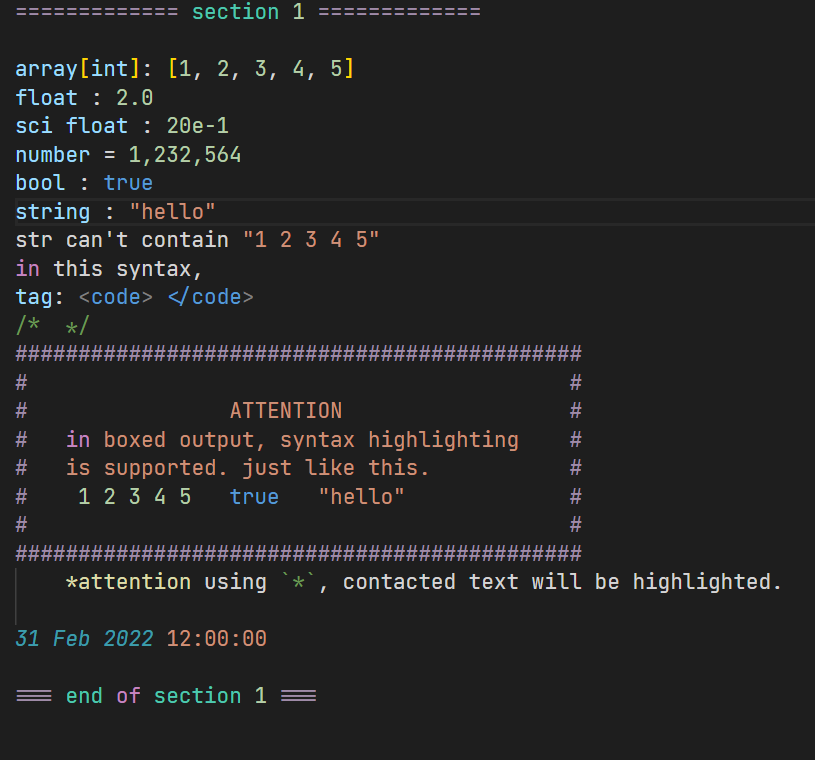

# outdesc-syntax README

This is the README for "outdesc-syntax". It provides a syntax highlighting for plaintext files as report formats.

## Features

Numbers, strings and booleans are supported to highlight them.

Also, these keywords are supported: 
- `on`
- `in`
- `at`
- `for`
- `while`
- `return`
- `over`
- `of`

Fields value assigning are supported. e.g. `a = 1 | b : true ; c = "qwerty"`

Tag highlighting is supported. Using syntax: `<tagname>`

Citing, cutting line, box-text and highlighting are supported. Look at the example below.

## Requirements and Setup

no requirements,

you may use theme in this extension.

or custom color for these scopes:

- `string.quoted.outdesc` (strings, box text)
- `constant.numeric.outdesc` (numbers)
- `constant.language.outdesc` (booleans)
- `keyword.control.outdesc` (keywords)
- `entity.name.section.outdesc` (cutting line text)
- `punctuation.definition.heading.outdesc` (cutting line)
- `variable.outdesc` (fields value assigning)
- `entity.name.tag.outdesc` (tagname)
- `punctuation.definition.tag.outdesc` (tagname symbol)
- `comment.outdesc` (citing)
- `punctuation.definition.heading.outdesc` (box wall)

## Known Issues

Calling out known issues can help limit users opening duplicate issues against your extension.

## Release Notes

Users appreciate release notes as you update your extension.

### 1.0.0

Initial release of outdesc-syntax.

---

**Enjoy!**
